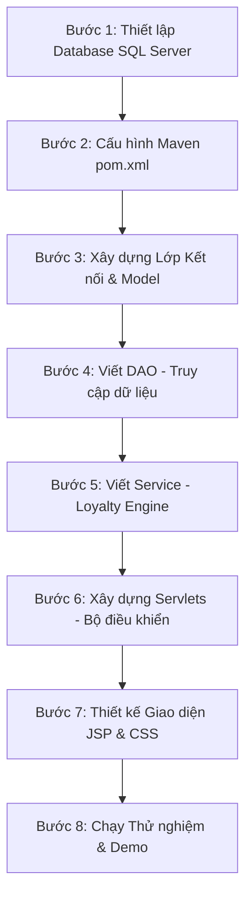

# HƯỚNG DẪN TRIỂN KHAI DỰ ÁN AUTOWASH PRO TỪNG BƯỚC

Chào bạn! Thật tuyệt vời khi bạn muốn **tự tay triển khai** dự án **AutoWash Pro**. Việc tự làm không chỉ giúp bạn hiểu sâu sắc kiến trúc hệ thống (MVC, Database, Servlet, JSP) mà còn giúp bạn tự tin bảo vệ đồ án 100% trước hội đồng giám khảo.

Tài liệu này được biên soạn chi tiết và thực tế nhất để làm **"Bản đồ chỉ đường"** cho bạn. Hãy đi từng bước một theo hướng dẫn dưới đây.

---

## 🗺️ TỔNG QUAN LỘ TRÌNH THỰC HIỆN



---

## BƯỚC 1: THIẾT LẬP CƠ SỞ DỮ LIỆU (SQL SERVER)

Hãy mở **SQL Server Management Studio (SSMS)**, tạo mới cơ sở dữ liệu tên là `AutoWashPro` và chạy đoạn mã SQL dưới đây. Đoạn mã này đã bao gồm:
1. Tạo 6 bảng theo đúng chuẩn thiết kế.
2. Thiết lập ràng buộc khóa ngoại chặt chẽ.
3. Chèn sẵn dữ liệu cấu hình các hạng thẻ (`Tiers`) và dữ liệu mẫu để bạn chạy thử nghiệm.

> [!IMPORTANT]
> Lưu lại script này để phục vụ việc khôi phục dữ liệu nhanh khi báo cáo (NFR-05).

```sql
-- 1. Tạo Database
CREATE DATABASE AutoWashPro;
GO

USE AutoWashPro;
GO

-- 2. Tạo Bảng Tiers (Hạng thành viên)
CREATE TABLE Tiers (
    TierId VARCHAR(20) PRIMARY KEY,
    TierName NVARCHAR(50) NOT NULL,
    MinWashes INT NOT NULL,
    MinSpent DECIMAL(18,2) NOT NULL,
    Multiplier FLOAT NOT NULL DEFAULT 1.0,
    BookingDays INT NOT NULL
);

-- 3. Tạo Bảng Users (Tài khoản)
CREATE TABLE Users (
    UserId INT IDENTITY(1,1) PRIMARY KEY,
    PhoneNumber VARCHAR(15) UNIQUE NOT NULL,
    Password VARCHAR(255) NOT NULL, -- Sẽ lưu mật khẩu băm
    FullName NVARCHAR(100) NOT NULL,
    Role VARCHAR(20) NOT NULL DEFAULT 'CUSTOMER', -- ADMIN, STAFF, CUSTOMER
    CurrentTierId VARCHAR(20) DEFAULT 'MEMBER' FOREIGN KEY REFERENCES Tiers(TierId),
    PointsBalance INT NOT NULL DEFAULT 0,
    TotalSpent DECIMAL(18,2) NOT NULL DEFAULT 0,
    TotalWashes INT NOT NULL DEFAULT 0,
    CreatedAt DATETIME DEFAULT GETDATE()
);

-- 4. Tạo Bảng LicensePlates (Biển số xe)
CREATE TABLE LicensePlates (
    PlateId INT IDENTITY(1,1) PRIMARY KEY,
    UserId INT FOREIGN KEY REFERENCES Users(UserId),
    PlateNumber VARCHAR(20) UNIQUE NOT NULL,
    VehicleModel NVARCHAR(100) NULL,
    CreatedAt DATETIME DEFAULT GETDATE()
);

-- 5. Tạo Bảng Bookings (Lịch đặt chỗ)
CREATE TABLE Bookings (
    BookingId INT IDENTITY(1,1) PRIMARY KEY,
    UserId INT FOREIGN KEY REFERENCES Users(UserId),
    PlateId INT FOREIGN KEY REFERENCES LicensePlates(PlateId),
    BookingDate DATE NOT NULL,
    TimeSlot VARCHAR(10) NOT NULL, -- Ví dụ: '08:00-09:00'
    Status VARCHAR(20) NOT NULL DEFAULT 'PENDING', -- PENDING, COMPLETED, CANCELLED
    Notes NVARCHAR(255) NULL,
    CreatedAt DATETIME DEFAULT GETDATE()
);

-- 6. Tạo Bảng LoyaltyTransactions (Lịch sử điểm)
CREATE TABLE LoyaltyTransactions (
    TransactionId INT IDENTITY(1,1) PRIMARY KEY,
    UserId INT FOREIGN KEY REFERENCES Users(UserId),
    Type VARCHAR(10) NOT NULL, -- 'EARN' hoặc 'REDEEM'
    Points INT NOT NULL,
    RelatedBillAmount DECIMAL(18,2) NOT NULL,
    CreatedAt DATETIME DEFAULT GETDATE()
);

-- 7. Tạo Bảng Notifications (Thông báo)
CREATE TABLE Notifications (
    NotificationId INT IDENTITY(1,1) PRIMARY KEY,
    UserId INT FOREIGN KEY REFERENCES Users(UserId),
    Title NVARCHAR(150) NOT NULL,
    Content NVARCHAR(MAX) NOT NULL,
    IsRead BIT NOT NULL DEFAULT 0,
    CreatedAt DATETIME DEFAULT GETDATE()
);
GO

-- =================================================================
-- CHÈN DỮ LIỆU MẪU BAN ĐẦU (MOCK DATA)
-- =================================================================

-- Chèn cấu hình 4 hạng thẻ chuẩn
INSERT INTO Tiers (TierId, TierName, MinWashes, MinSpent, Multiplier, BookingDays) VALUES
('MEMBER', N'Đồng (Member)', 0, 0, 1.0, 7),
('SILVER', N'Bạc (Silver)', 5, 2000000, 1.1, 10),
('GOLD', N'Vàng (Gold)', 15, 6000000, 1.2, 12),
('PLATINUM', N'Bạch Kim (Platinum)', 30, 15000000, 1.3, 14);

-- Chèn tài khoản Admin/Staff và Khách hàng mẫu
-- Mật khẩu dưới đây đều là '123456' (sau này bạn có thể viết hàm mã hóa MD5 hoặc SHA-256)
INSERT INTO Users (PhoneNumber, Password, FullName, Role, CurrentTierId, PointsBalance, TotalSpent, TotalWashes) VALUES
('0988888888', '123456', N'Quản trị viên Hệ thống', 'ADMIN', NULL, 0, 0, 0),
('0977777777', '123456', N'Nhân viên Quầy tiếp đón', 'STAFF', NULL, 0, 0, 0),
('0912345678', '123456', N'Nguyễn Văn Bình', 'CUSTOMER', 'GOLD', 1500, 7500000, 18),
('0909090909', '123456', N'Lê Minh Triết', 'CUSTOMER', 'MEMBER', 0, 0, 0);

-- Chèn biển số xe mẫu cho khách hàng Nguyễn Văn Bình (UserId = 3)
INSERT INTO LicensePlates (UserId, PlateNumber, VehicleModel) VALUES
(3, '30A-999.99', N'Toyota Camry'),
(3, '51F-123.45', N'Honda Civic');

-- Chèn lịch đặt mẫu đang chờ tiếp đón
INSERT INTO Bookings (UserId, PlateId, BookingDate, TimeSlot, Status, Notes) VALUES
(3, 1, CAST(GETDATE() AS DATE), '09:00-10:00', 'PENDING', N'Rửa kỹ khoang máy giúp em');

-- Chèn thông báo mẫu cho khách hàng Nguyễn Văn Bình
INSERT INTO Notifications (UserId, Title, Content, IsRead) VALUES
(3, N'Chúc mừng thăng hạng', N'Tài khoản của bạn đã được nâng lên hạng GOLD trong kỳ đánh giá vừa qua!', 0),
(3, N'Nhắc lịch hẹn', N'Lịch đặt rửa xe biển số 30A-999.99 lúc 09:00-10:00 hôm nay sắp diễn ra.', 0);
GO
```

---

## BƯỚC 2: CẤU HÌNH FILE `pom.xml`

Để kết nối được cơ sở dữ liệu SQL Server, sử dụng các thẻ Tag JSTL trong JSP, và hỗ trợ truyền nhận dữ liệu AJAX (qua Gson), bạn hãy thêm các thư viện sau vào khối `<dependencies>` của file [pom.xml](file:///c:/Users/nguye/Documents/Summer_2026/CSD/CSD_Code_Template/AutoWashPro/pom.xml):

```xml
<!-- 1. Microsoft SQL Server JDBC Driver -->
<dependency>
    <groupId>com.microsoft.sqlserver</groupId>
    <artifactId>mssql-jdbc</artifactId>
    <version>12.2.0.jre8</version> <!-- Phù hợp với Java 8+ -->
</dependency>

<!-- 2. JSTL (JavaServer Pages Standard Tag Library) để lặp hiển thị dữ liệu -->
<dependency>
    <groupId>javax.servlet</groupId>
    <artifactId>jstl</artifactId>
    <version>1.2</version>
</dependency>

<!-- 3. Google Gson để xử lý dữ liệu JSON (dành cho thông báo AJAX và Chart.js) -->
<dependency>
    <groupId>com.google.code.gson</groupId>
    <artifactId>gson</artifactId>
    <version>2.10.1</version>
</dependency>
```

> [!TIP]
> **Nâng cấp phiên bản Java (Khuyên dùng):** Hãy thay đổi cấu hình `<source>` và `<target>` của `maven-compiler-plugin` trong `pom.xml` từ `1.7` lên `1.8` để sử dụng được các tính năng hiện đại của Java 8 như Lambda, Stream API và các kiểu dữ liệu thời gian mới.

---

## BƯỚC 3: XÂY DỰNG CẤU TRÚC THƯ MỤC & LỚP KẾT NỐI

Hãy tạo các package sau dưới thư mục `src/main/java`:
- `com.autowash.autowashpro.connection`: Chứa lớp kết nối DB.
- `com.autowash.autowashpro.model`: Chứa các lớp Entity đại diện các bảng.
- `com.autowash.autowashpro.dao`: Chứa các lớp tương tác SQL (Data Access Object).
- `com.autowash.autowashpro.service`: Chứa các nghiệp vụ Loyalty, thăng hạng, tính điểm.
- `com.autowash.autowashpro.controller`: Chứa các Servlet xử lý Request.
- `com.autowash.autowashpro.filter`: Chứa Filter phân quyền bảo mật.

### 🔌 Lớp kết nối cơ sở dữ liệu (`DBContext.java`)
Tạo file `DBContext.java` trong package `com.autowash.autowashpro.connection`:

```java
package com.autowash.autowashpro.connection;

import java.sql.Connection;
import java.sql.DriverManager;
import java.sql.SQLException;

public class DBContext {
    private static final String HOSTNAME = "localhost";
    private static final String PORT = "1433";
    private static final String DBNAME = "AutoWashPro";
    private static final String USERNAME = "sa"; // Thay bằng username SQL của bạn
    private static final String PASSWORD = "123"; // Thay bằng password SQL của bạn

    public static Connection getConnection() {
        try {
            Class.forName("com.microsoft.sqlserver.jdbc.SQLServerDriver");
            String connectionUrl = "jdbc:sqlserver://" + HOSTNAME + ":" + PORT + ";databaseName=" + DBNAME + ";encrypt=true;trustServerCertificate=true;";
            return DriverManager.getConnection(connectionrl, USERNAME, PASSWORD);
        } catch (ClassNotFoundException | SQLException e)U {
            System.err.println("Database Connection Error: " + e.getMessage());
            return null;
        }
    }

    // Hàm để chạy test kết nối nhanh bằng Console
    public static void main(String[] args) {
        Connection conn = getConnection();
        if (conn != null) {
            System.out.println("Kết nối cơ sở dữ liệu AutoWashPro THÀNH CÔNG!");
        } else {
            System.out.println("Kết nối cơ sở dữ liệu THẤT BẠI!");
        }
    }
}
```

---

## BƯỚC 4: XÂY DỰNG MÔ HÌNH DỮ LIỆU & DAO (DATA ACCESS OBJECT)

Chúng ta cần tạo ra các Model khớp hoàn toàn với cấu trúc DB. Dưới đây là ví dụ về `User.java` và lớp truy vấn `UserDAO.java`.

### 📦 Ví dụ lớp Model: `User.java`
Tạo file `User.java` trong package `com.autowash.autowashpro.model`:

```java
package com.autowash.autowashpro.model;

import java.util.Date;

public class User {
    private int userId;
    private String phoneNumber;
    private String password;
    private String fullName;
    private String role;
    private String currentTierId;
    private int pointsBalance;
    private double totalSpent;
    private int totalWashes;
    private Date createdAt;

    // Constructors
    public User() {}

    public User(int userId, String phoneNumber, String password, String fullName, String role, String currentTierId, int pointsBalance, double totalSpent, int totalWashes, Date createdAt) {
        this.userId = userId;
        this.phoneNumber = phoneNumber;
        this.password = password;
        this.fullName = fullName;
        this.role = role;
        this.currentTierId = currentTierId;
        this.pointsBalance = pointsBalance;
        this.totalSpent = totalSpent;
        this.totalWashes = totalWashes;
        this.createdAt = createdAt;
    }

    // Getters and Setters (Tự sinh hoặc viết thủ công)
    public int getUserId() { return userId; }
    public void setUserId(int userId) { this.userId = userId; }
    public String getPhoneNumber() { return phoneNumber; }
    public void setPhoneNumber(String phoneNumber) { this.phoneNumber = phoneNumber; }
    public String getPassword() { return password; }
    public void setPassword(String password) { this.password = password; }
    public String getFullName() { return fullName; }
    public void setFullName(String fullName) { this.fullName = fullName; }
    public String getRole() { return role; }
    public void setRole(String role) { this.role = role; }
    public String getCurrentTierId() { return currentTierId; }
    public void setCurrentTierId(String currentTierId) { this.currentTierId = currentTierId; }
    public int getPointsBalance() { return pointsBalance; }
    public void setPointsBalance(int pointsBalance) { this.pointsBalance = pointsBalance; }
    public double getTotalSpent() { return totalSpent; }
    public void setTotalSpent(double totalSpent) { this.totalSpent = totalSpent; }
    public int getTotalWashes() { return totalWashes; }
    public void setTotalWashes(int totalWashes) { this.totalWashes = totalWashes; }
    public Date getCreatedAt() { return createdAt; }
    public void setCreatedAt(Date createdAt) { this.createdAt = createdAt; }
}
```

### 🗃️ Ví dụ lớp DAO: `UserDAO.java`
Tạo file `UserDAO.java` trong package `com.autowash.autowashpro.dao`:

```java
package com.autowash.autowashpro.dao;

import com.autowash.autowashpro.connection.DBContext;
import com.autowash.autowashpro.model.User;
import java.sql.Connection;
import java.sql.PreparedStatement;
import java.sql.ResultSet;
import java.sql.SQLException;

public class UserDAO {

    // Hàm xác thực Đăng nhập
    public User login(String phoneNumber, String password) {
        String sql = "SELECT * FROM Users WHERE PhoneNumber = ? AND Password = ?";
        try (Connection conn = DBContext.getConnection();
             PreparedStatement ps = conn.prepareStatement(sql)) {
            ps.setString(1, phoneNumber);
            ps.setString(2, password); // Để đơn giản, so khớp text trực tiếp. Thực tế nên băm
            
            try (ResultSet rs = ps.executeQuery()) {
                if (rs.next()) {
                    return new User(
                        rs.getInt("UserId"),
                        rs.getString("PhoneNumber"),
                        rs.getString("Password"),
                        rs.getString("FullName"),
                        rs.getString("Role"),
                        rs.getString("CurrentTierId"),
                        rs.getInt("PointsBalance"),
                        rs.getDouble("TotalSpent"),
                        rs.getInt("TotalWashes"),
                        rs.getTimestamp("CreatedAt")
                    );
                }
            }
        } catch (SQLException e) {
            e.printStackTrace();
        }
        return null;
    }

    // Đăng ký khách hàng mới
    public boolean registerCustomer(String phoneNumber, String password, String fullName) {
        String sql = "INSERT INTO Users (PhoneNumber, Password, FullName, Role, CurrentTierId) VALUES (?, ?, ?, 'CUSTOMER', 'MEMBER')";
        try (Connection conn = DBContext.getConnection();
             PreparedStatement ps = conn.prepareStatement(sql)) {
            ps.setString(1, phoneNumber);
            ps.setString(2, password);
            ps.setString(3, fullName);
            return ps.executeUpdate() > 0;
        } catch (SQLException e) {
            e.printStackTrace();
        }
        return false;
    }
}
```

---

## BƯỚC 5: XÂY DỰNG TRÁI TIM CỦA ĐỒ ÁN - LOYALTY ENGINE SERVICE

Hãy tạo lớp `LoyaltyService.java` trong package `com.autowash.autowashpro.service`. Đây là nơi chứa thuật toán cốt lõi tính toán **tiến trình phần thưởng kế tiếp (Next Reward)** và **quy tắc thăng/hạ hạng** giúp ứng dụng hoạt động chính xác theo đúng tài liệu SRS.

```java
package com.autowash.autowashpro.service;

import com.autowash.autowashpro.model.User;
import java.util.HashMap;
import java.util.Map;

public class LoyaltyService {

    // Điểm quy đổi ra tiền giảm giá: 1 điểm = 100 VNĐ
    public static final int POINT_CONVERSION_RATE = 100;
    
    // Tỉ lệ tích điểm cơ sở: Chi tiêu 1.000 VNĐ được 1 điểm cơ sở
    public static final double EARN_POINT_RATE = 1000.0;

    /**
     * Lấy hệ số nhân tích điểm (Multiplier) dựa trên hạng thẻ
     */
    public static double getMultiplier(String tierId) {
        if (tierId == null) return 1.0;
        switch (tierId.toUpperCase()) {
            case "SILVER": return 1.1;
            case "GOLD": return 1.2;
            case "PLATINUM": return 1.3;
            case "MEMBER":
            default:
                return 1.0;
        }
    }

    /**
     * Tính toán tiến trình thăng hạng (Next Reward Progress) dựa trên thông số khách hàng
     */
    public static Map<String, Object> calculateNextReward(User user) {
        Map<String, Object> result = new HashMap<>();
        String currentTier = user.getCurrentTierId() != null ? user.getCurrentTierId().toUpperCase() : "MEMBER";
        int washes = user.getTotalWashes();
        double spent = user.getTotalSpent();

        int targetWashes = 0;
        double targetSpent = 0;
        String nextTierName = "";
        String message = "";
        double percent = 0.0;

        switch (currentTier) {
            case "MEMBER":
                nextTierName = "SILVER";
                targetWashes = 5;
                targetSpent = 2000000;
                
                int washesNeeded = Math.max(0, targetWashes - washes);
                double spentNeeded = Math.max(0, targetSpent - spent);
                
                // Tính % dựa trên chỉ số nào gần đạt được nhất
                double pWashes = (double) washes / targetWashes * 100;
                double pSpent = spent / targetSpent * 100;
                percent = Math.min(100.0, Math.max(pWashes, pSpent));
                
                message = "Bạn chỉ còn cách hạng Silver " + washesNeeded + " lượt rửa hoặc " + 
                          String.format("%,.0f", spentNeeded) + " VNĐ chi tiêu để nhận ưu đãi nhân 1.1 lần điểm thưởng!";
                break;

            case "SILVER":
                nextTierName = "GOLD";
                targetWashes = 15;
                targetSpent = 6000000;

                washesNeeded = Math.max(0, targetWashes - washes);
                spentNeeded = Math.max(0, targetSpent - spent);

                pWashes = (double) washes / targetWashes * 100;
                pSpent = spent / targetSpent * 100;
                percent = Math.min(100.0, Math.max(pWashes, pSpent));

                message = "Bạn chỉ còn cách hạng Gold " + washesNeeded + " lượt rửa hoặc " + 
                          String.format("%,.0f", spentNeeded) + " VNĐ chi tiêu để đặt lịch trước 12 ngày và 1 lần nâng cấp dịch vụ miễn phí!";
                break;

            case "GOLD":
                nextTierName = "PLATINUM";
                targetWashes = 30;
                targetSpent = 15000000;

                washesNeeded = Math.max(0, targetWashes - washes);
                spentNeeded = Math.max(0, targetSpent - spent);

                pWashes = (double) washes / targetWashes * 100;
                pSpent = spent / targetSpent * 100;
                percent = Math.min(100.0, Math.max(pWashes, pSpent));

                message = "Bạn chỉ còn cách hạng Platinum " + washesNeeded + " lượt rửa hoặc " + 
                          String.format("%,.0f", spentNeeded) + " VNĐ chi tiêu để nhận ưu đãi cao nhất: đặt lịch trước 14 ngày!";
                break;

            case "PLATINUM":
                // Đã đạt đỉnh -> Khuyến khích đổi quà (Gói Phủ Nano 300 điểm)
                nextTierName = "QUÀ NANO CƠ BẢN";
                int pointsBalance = user.getPointsBalance();
                percent = Math.min(100.0, ((double) pointsBalance / 300) * 100);
                int pointsNeeded = Math.max(0, 300 - pointsBalance);
                
                if (pointsNeeded == 0) {
                    message = "Bạn đã đủ 300 điểm! Đổi ngay 01 lần Phủ Wax/Nano miễn phí trị giá 50.000 VNĐ!";
                } else {
                    message = "Bạn đang sở hữu " + pointsBalance + "/300 điểm để đổi ngay Gói phủ Wax/Nano miễn phí. Cần thêm " + pointsNeeded + " điểm nữa!";
                }
                break;
        }

        result.put("nextTier", nextTierName);
        result.put("percent", percent);
        result.put("message", message);
        return result;
    }
}
```

---

## BƯỚC 6: XÂY DỰNG SERVLET (CONTROLLER LAYER)

Servlet sẽ tiếp nhận thông tin từ form hoặc AJAX, gọi DAO và Service để xử lý, sau đó điều hướng người dùng tới trang JSP thích hợp.

### 📝 Ví dụ: `DashboardServlet.java` (Xem Dashboard Khách Hàng)
Tạo file `DashboardServlet.java` trong package `com.autowash.autowashpro.controller`:

```java
package com.autowash.autowashpro.controller;

import com.autowash.autowashpro.model.User;
import com.autowash.autowashpro.service.LoyaltyService;
import java.io.IOException;
import java.util.Map;
import javax.servlet.ServletException;
import javax.servlet.annotation.WebServlet;
import javax.servlet.http.HttpServlet;
import javax.servlet.http.HttpServletRequest;
import javax.servlet.http.HttpServletResponse;
import javax.servlet.http.HttpSession;

@WebServlet("/customer/dashboard")
public class DashboardServlet extends HttpServlet {
    @Override
    protected void doGet(HttpServletRequest request, HttpServletResponse response) 
            throws ServletException, IOException {
        
        HttpSession session = request.getSession();
        User loggedInUser = (User) session.getAttribute("user");
        
        // Kiểm tra phân quyền nhanh nếu chưa có Filter bảo vệ
        if (loggedInUser == null || !"CUSTOMER".equals(loggedInUser.getRole())) {
            response.sendRedirect(request.getContextPath() + "/login.jsp");
            return;
        }

        // Tính toán thông tin "Next Reward Progress" thông qua Service
        Map<String, Object> nextRewardInfo = LoyaltyService.calculateNextReward(loggedInUser);
        
        // Đẩy dữ liệu ra giao diện JSP
        request.setAttribute("rewardPercent", nextRewardInfo.get("percent"));
        request.setAttribute("rewardMessage", nextRewardInfo.get("message"));
        request.setAttribute("nextTier", nextRewardInfo.get("nextTier"));
        
        request.getRequestDispatcher("/customer/dashboard.jsp").forward(request, response);
    }
}
```

---

## BƯỚC 7: THIẾT KẾ GIAO DIỆN HIỆN ĐẠI (VIEW LAYER - JSP & TAILWIND CSS)

Để tạo hiệu ứng **"WOW"** về mặt thẩm mỹ như tài liệu Design yêu cầu, chúng ta sẽ nhúng trực tiếp **Tailwind CSS CDN** và sử dụng font chữ **Inter** hiện đại.

### 📱 Giao diện Mobile Dashboard Khách hàng (`customer/dashboard.jsp`)
Hãy tạo thư mục `customer` trong `src/main/webapp` và tạo file `dashboard.jsp` như sau:

```jsp
<%@ page contentType="text/html;charset=UTF-8" language="java" %>
<%@ taglib prefix="c" uri="http://java.sun.com/jsp/jstl/core" %>
<!DOCTYPE html>
<html lang="vi">
<head>
    <meta charset="UTF-8">
    <meta name="viewport" content="width=device-width, initial-scale=1.0">
    <title>AutoWash Pro - Dashboard</title>
    <!-- Tailwind CSS và Google Font Inter -->
    <script src="https://cdn.tailwindcss.com"></script>
    <link href="https://fonts.googleapis.com/css2?family=Inter:wght@300;400;500;600;700&display=swap" rel="stylesheet">
    <style>
        body { font-family: 'Inter', sans-serif; }
    </style>
</head>
<body class="bg-slate-50 text-slate-900 pb-24">

    <!-- Header có Tên & Quả chuông Thông Báo -->
    <header class="bg-slate-900 text-white px-6 pt-8 pb-12 rounded-b-[2rem] shadow-lg">
        <div class="flex justify-between items-center mb-6">
            <div>
                <p class="text-slate-400 text-sm">Chào mừng quay lại,</p>
                <h1 class="text-2xl font-bold">${sessionScope.user.fullName}</h1>
            </div>
            <!-- Bell Icon -->
            <button class="relative bg-slate-800 p-3 rounded-full hover:bg-slate-700 transition">
                <svg xmlns="http://www.w3.org/2000/svg" class="h-6 w-6 text-cyan-400" fill="none" viewBox="0 0 24 24" stroke="currentColor">
                    <path stroke-linecap="round" stroke-linejoin="round" stroke-width="2" d="M15 17h5l-1.405-1.405A2.032 2.032 0 0118 14.158V11a6.002 6.002 0 00-4-5.659V5a2 2 0 10-4 0v.341C7.67 6.165 6 8.388 6 11v3.159c0 .538-.214 1.055-.595 1.436L4 17h5m6 0v1a3 3 0 11-6 0v-1m6 0H9" />
                </svg>
                <span class="absolute top-1 right-1 bg-rose-500 w-3 h-3 rounded-full border-2 border-slate-900"></span>
            </button>
        </div>

        <!-- Thẻ hạng Thành viên động -->
        <div class="mt-4 bg-gradient-to-r from-slate-800 to-slate-700 p-6 rounded-2xl border border-slate-700 shadow-md">
            <span class="text-xs uppercase tracking-wider text-slate-400 font-semibold">Hạng thành viên hiện tại</span>
            <div class="flex justify-between items-center mt-1">
                <c:choose>
                    <c:when test="${sessionScope.user.currentTierId == 'PLATINUM'}">
                        <span class="text-2xl font-black text-cyan-400">👑 PLATINUM</span>
                    </c:when>
                    <c:when test="${sessionScope.user.currentTierId == 'GOLD'}">
                        <span class="text-2xl font-black text-amber-500">👑 GOLD</span>
                    </c:when>
                    <c:when test="${sessionScope.user.currentTierId == 'SILVER'}">
                        <span class="text-2xl font-black text-slate-300">👑 SILVER</span>
                    </c:when>
                    <c:otherwise>
                        <span class="text-2xl font-black text-slate-400">💎 MEMBER</span>
                    </c:otherwise>
                </c:choose>
                <span class="text-xs px-3 py-1 bg-slate-900 text-cyan-400 rounded-full font-medium">Hệ số: x${LoyaltyService.getMultiplier(sessionScope.user.currentTierId)} Điểm</span>
            </div>
        </div>
    </header>

    <!-- Main Content Container -->
    <main class="px-6 -mt-8 space-y-6">

        <!-- Ví Điểm Thưởng -->
        <section class="bg-white p-6 rounded-2xl shadow-md border border-slate-100">
            <h2 class="text-xs font-semibold text-slate-400 uppercase tracking-wider">Ví điểm tích lũy</h2>
            <div class="flex justify-between items-end mt-2">
                <div>
                    <span class="text-4xl font-bold text-slate-900">${sessionScope.user.pointsBalance}</span>
                    <span class="text-slate-500 ml-1">điểm</span>
                </div>
                <span class="text-emerald-500 text-sm font-semibold mb-1">
                    ≈ ${sessionScope.user.pointsBalance * 100} VNĐ
                </span>
            </div>
        </section>

        <!-- Tiến trình phần thưởng kế tiếp (Loyalty Engine Visualizer) -->
        <section class="bg-white p-6 rounded-2xl shadow-md border border-slate-100">
            <h3 class="text-sm font-bold text-slate-800">Mục tiêu thăng hạng tiếp theo: <span class="text-cyan-600">${nextTier}</span></h3>
            
            <!-- Progress Bar -->
            <div class="w-full bg-slate-100 h-4 rounded-full mt-4 overflow-hidden relative">
                <div class="bg-gradient-to-r from-cyan-500 to-indigo-600 h-full rounded-full transition-all duration-1000 ease-out" style="width: ${rewardPercent}%"></div>
            </div>
            <div class="flex justify-between items-center text-xs text-slate-400 mt-2">
                <span>Trạng thái hiện tại</span>
                <span class="font-bold text-indigo-600">${rewardPercent}%</span>
            </div>

            <!-- Dòng text mô tả động tính toán từ Service -->
            <div class="mt-4 p-3 bg-slate-50 rounded-xl border border-slate-100 text-xs text-slate-600 leading-relaxed">
                ℹ️ ${rewardMessage}
            </div>
        </section>

        <!-- Lịch hẹn sắp tới -->
        <section class="bg-white p-6 rounded-2xl shadow-md border border-slate-100">
            <h3 class="text-sm font-bold text-slate-800 mb-4">Lịch rửa xe sắp diễn ra</h3>
            <!-- Phần này bạn sẽ dùng <c:forEach> để lặp list Bookings chờ tiếp tiếp nhận -->
            <div class="p-4 bg-slate-50 rounded-xl border border-slate-100">
                <div class="flex justify-between items-start">
                    <div>
                        <p class="font-bold text-slate-900 text-base">Xe: 30A-999.99</p>
                        <p class="text-xs text-slate-500 mt-1">Ngày: Ngày mai | Khung giờ: 09:00 - 10:00</p>
                    </div>
                    <span class="px-3 py-1 bg-amber-100 text-amber-800 text-xs rounded-full font-medium">Chờ tiếp đón</span>
                </div>
            </div>
        </section>
    </main>

    <!-- Bottom Navigation Bar (Dành cho trải nghiệm di động chuẩn App) -->
    <nav class="fixed bottom-0 left-0 right-0 bg-white border-t border-slate-200 py-3 px-6 shadow-2xl flex justify-between items-center z-50">
        <a href="#" class="flex flex-col items-center text-cyan-600 space-y-1">
            <svg xmlns="http://www.w3.org/2000/svg" class="h-6 w-6" fill="none" viewBox="0 0 24 24" stroke="currentColor">
                <path stroke-linecap="round" stroke-linejoin="round" stroke-width="2" d="M3 12l2-2m0 0l7-7 7 7M5 10v10a1 1 0 001 1h3m10-11l2 2m-2-2v10a1 1 0 01-1 1h-3m-6 0a1 1 0 001-1v-4a1 1 0 011-1h2a1 1 0 011 1v4a1 1 0 001 1m-6 0h6" />
            </svg>
            <span class="text-[10px] font-bold">Trang chủ</span>
        </a>
        <a href="${pageContext.request.contextPath}/customer/booking" class="flex flex-col items-center text-slate-400 space-y-1 hover:text-cyan-500 transition">
            <svg xmlns="http://www.w3.org/2000/svg" class="h-6 w-6" fill="none" viewBox="0 0 24 24" stroke="currentColor">
                <path stroke-linecap="round" stroke-linejoin="round" stroke-width="2" d="M8 7V3m8 4V3m-9 8h10M5 21h14a2 2 0 002-2V7a2 2 0 00-2-2H5a2 2 0 00-2 2v12a2 2 0 002 2z" />
            </svg>
            <span class="text-[10px]">Đặt lịch</span>
        </a>
        <a href="${pageContext.request.contextPath}/customer/plates" class="flex flex-col items-center text-slate-400 space-y-1 hover:text-cyan-500 transition">
            <svg xmlns="http://www.w3.org/2000/svg" class="h-6 w-6" fill="none" viewBox="0 0 24 24" stroke="currentColor">
                <path stroke-linecap="round" stroke-linejoin="round" stroke-width="2" d="M9 17a2 2 0 11-4 0 2 2 0 014 0zM19 17a2 2 0 11-4 0 2 2 0 014 0z" />
                <path stroke-linecap="round" stroke-linejoin="round" stroke-width="2" d="M13 16V6a1 1 0 00-1-1H4a1 1 0 00-1 1v10M21 16V14a2 2 0 00-2-2h-3m0 0V5a2 2 0 012-2h2a2 2 0 012 2v11" />
            </svg>
            <span class="text-[10px]">Xe của tôi</span>
        </a>
        <a href="${pageContext.request.contextPath}/customer/notifications" class="flex flex-col items-center text-slate-400 space-y-1 hover:text-cyan-500 transition">
            <svg xmlns="http://www.w3.org/2000/svg" class="h-6 w-6" fill="none" viewBox="0 0 24 24" stroke="currentColor">
                <path stroke-linecap="round" stroke-linejoin="round" stroke-width="2" d="M20 13V6a2 2 0 00-2-2H6a2 2 0 00-2 2v7m16 0a2 2 0 01-2 2H6a2 2 0 01-2-2m16 0V9a2 2 0 00-2-2H6a2 2 0 00-2 2v4" />
            </svg>
            <span class="text-[10px]">Thông báo</span>
        </a>
    </nav>
</body>
</html>
```

---

## BƯỚC 8: KIỂM CHỨNG & CHẠY DEMO HỘI ĐỒNG (LINEAR DEMO RUN)

Khi chạy thử nghiệm hoặc lúc báo cáo trước thầy cô, hãy làm theo quy trình 5 bước kịch bản demo tuyến tính đã đặc tả trong [SRS.md:L302-351](file:///c:/Users/nguye/Documents/Summer_2026/CSD/CSD_Code_Template/AutoWashPro/Docs/SRS.md#L302-351). Nó sẽ thể hiện đầy đủ độ tin cậy và sự chính xác trong toàn bộ hệ thống của bạn!

### 💡 LỜI KHUYÊN PHÁT TRIỂN
1. **Làm tới đâu, kiểm thử tới đó:** Bắt đầu bằng việc viết file `DBContext.java` và chạy file đó bằng console (hàm `main` có sẵn ở trên) để đảm bảo kết nối SQL Server đã thông suốt trước khi viết code cho trang Web.
2. **Kiểm thử logic bằng Service trước:** Hãy thử viết các test case đơn giản để tính điểm và thăng hạng nhằm đảm bảo thuật toán Loyalty của bạn chạy đúng 100% trước khi tích hợp vào Servlet và cơ sở dữ liệu.
3. **Sử dụng AJAX cho Hộp thư thông báo:** Khi người dùng bấm xem thông báo, dùng JavaScript `fetch()` gọi tới `/customer/notifications` để đánh dấu `IsRead = 1` mà không cần load lại trang. Đây là điểm cộng cực kỳ lớn cho tính thẩm mỹ và công nghệ.

Chúc bạn có một trải nghiệm lập trình thú vị và đạt điểm tối đa cho đồ án **AutoWash Pro**! Nếu gặp bất kỳ lỗi nào hoặc cần code mẫu cho các Servlet/JSP khác, hãy hỏi mình bất cứ lúc nào!
