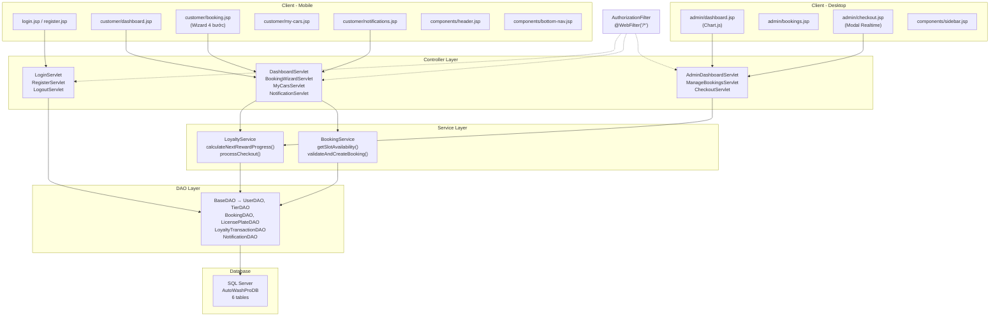

# AutoWash Pro — Walkthrough Hoàn Thành

## 📊 Tổng quan: 45+ files, 8 giai đoạn ✅

Tất cả các giai đoạn trong kế hoạch triển khai đã được hoàn thành. Dự án sẵn sàng để compile, deploy và test.

---

## 🏗️ Kiến trúc hệ thống



---

## ✅ Chi tiết từng lớp

### 1. Database Schema
| File | Chi tiết |
|------|----------|
| [AutoWashProDB_Schema.sql](file:///c:/Users/nguye/Documents/Summer_2026/CSD/CSD_Code_Template/AutoWashPro/Docs/AutoWashProDB_Schema.sql) | 6 bảng, 4 hạng thẻ seed, 4 users mẫu, bookings, transactions, notifications |

### 2. Model Layer (7 files)
| File | Bảng DB |
|------|---------|
| [Tier.java](file:///c:/Users/nguye/Documents/Summer_2026/CSD/CSD_Code_Template/AutoWashPro/src/main/java/com/autowash/autowashpro/model/Tier.java) | Tiers |
| [User.java](file:///c:/Users/nguye/Documents/Summer_2026/CSD/CSD_Code_Template/AutoWashPro/src/main/java/com/autowash/autowashpro/model/User.java) | Users |
| [LicensePlate.java](file:///c:/Users/nguye/Documents/Summer_2026/CSD/CSD_Code_Template/AutoWashPro/src/main/java/com/autowash/autowashpro/model/LicensePlate.java) | LicensePlates |
| [Booking.java](file:///c:/Users/nguye/Documents/Summer_2026/CSD/CSD_Code_Template/AutoWashPro/src/main/java/com/autowash/autowashpro/model/Booking.java) | Bookings |
| [LoyaltyTransaction.java](file:///c:/Users/nguye/Documents/Summer_2026/CSD/CSD_Code_Template/AutoWashPro/src/main/java/com/autowash/autowashpro/model/LoyaltyTransaction.java) | LoyaltyTransactions |
| [Notification.java](file:///c:/Users/nguye/Documents/Summer_2026/CSD/CSD_Code_Template/AutoWashPro/src/main/java/com/autowash/autowashpro/model/Notification.java) | Notifications |
| [DBContext.java](file:///c:/Users/nguye/Documents/Summer_2026/CSD/CSD_Code_Template/AutoWashPro/src/main/java/com/autowash/autowashpro/connection/DBContext.java) | SQL Server connection |

### 3. DAO Layer (7 files)
| File | Methods chính |
|------|---------------|
| [BaseDAO.java](file:///c:/Users/nguye/Documents/Summer_2026/CSD/CSD_Code_Template/AutoWashPro/src/main/java/com/autowash/autowashpro/dao/BaseDAO.java) | `getConnection()` |
| [TierDAO.java](file:///c:/Users/nguye/Documents/Summer_2026/CSD/CSD_Code_Template/AutoWashPro/src/main/java/com/autowash/autowashpro/dao/TierDAO.java) | `getNextTier()`, `determineTier()` |
| [UserDAO.java](file:///c:/Users/nguye/Documents/Summer_2026/CSD/CSD_Code_Template/AutoWashPro/src/main/java/com/autowash/autowashpro/dao/UserDAO.java) | `findByPhone()`, `updateTierAndPoints(conn)` |
| [LicensePlateDAO.java](file:///c:/Users/nguye/Documents/Summer_2026/CSD/CSD_Code_Template/AutoWashPro/src/main/java/com/autowash/autowashpro/dao/LicensePlateDAO.java) | `addPlate()`, `deletePlate(plateId, userId)` |
| [BookingDAO.java](file:///c:/Users/nguye/Documents/Summer_2026/CSD/CSD_Code_Template/AutoWashPro/src/main/java/com/autowash/autowashpro/dao/BookingDAO.java) | `getUpcomingByUserId()`, `countByDateAndSlot()` |
| [LoyaltyTransactionDAO.java](file:///c:/Users/nguye/Documents/Summer_2026/CSD/CSD_Code_Template/AutoWashPro/src/main/java/com/autowash/autowashpro/dao/LoyaltyTransactionDAO.java) | `insertTransaction(conn)` |
| [NotificationDAO.java](file:///c:/Users/nguye/Documents/Summer_2026/CSD/CSD_Code_Template/AutoWashPro/src/main/java/com/autowash/autowashpro/dao/NotificationDAO.java) | `getUnreadCount()`, `markAsRead()` |

### 4. Service Layer (2 files)
| File | Thuật toán |
|------|-----------|
| [LoyaltyService.java](file:///c:/Users/nguye/Documents/Summer_2026/CSD/CSD_Code_Template/AutoWashPro/src/main/java/com/autowash/autowashpro/service/LoyaltyService.java) | **Loyalty Engine**: `calculateNextRewardProgress()` (P = max(p_wash, p_spent)) + `processCheckout()` (6-step DB Transaction with auto-upgrade) |
| [BookingService.java](file:///c:/Users/nguye/Documents/Summer_2026/CSD/CSD_Code_Template/AutoWashPro/src/main/java/com/autowash/autowashpro/service/BookingService.java) | `getAvailableDates(bookingDays)`, `getSlotAvailability()`, `validateAndCreateBooking()` |

### 5. Filter + Config (2 files)
| File | Vai trò |
|------|---------|
| [AuthorizationFilter.java](file:///c:/Users/nguye/Documents/Summer_2026/CSD/CSD_Code_Template/AutoWashPro/src/main/java/com/autowash/autowashpro/filter/AuthorizationFilter.java) | `@WebFilter("/*")`: public resources → pass, no login → /login, role check → redirect |
| [web.xml](file:///c:/Users/nguye/Documents/Summer_2026/CSD/CSD_Code_Template/AutoWashPro/src/main/webapp/WEB-INF/web.xml) | Session 30min, error pages 404/500 |

### 6. Controllers (10 files)
| File | URL | Method |
|------|-----|--------|
| [LoginServlet](file:///c:/Users/nguye/Documents/Summer_2026/CSD/CSD_Code_Template/AutoWashPro/src/main/java/com/autowash/autowashpro/controller/auth/LoginServlet.java) | `/login` | GET/POST |
| [RegisterServlet](file:///c:/Users/nguye/Documents/Summer_2026/CSD/CSD_Code_Template/AutoWashPro/src/main/java/com/autowash/autowashpro/controller/auth/RegisterServlet.java) | `/register` | GET/POST |
| [LogoutServlet](file:///c:/Users/nguye/Documents/Summer_2026/CSD/CSD_Code_Template/AutoWashPro/src/main/java/com/autowash/autowashpro/controller/auth/LogoutServlet.java) | `/logout` | GET |
| [DashboardServlet](file:///c:/Users/nguye/Documents/Summer_2026/CSD/CSD_Code_Template/AutoWashPro/src/main/java/com/autowash/autowashpro/controller/customer/DashboardServlet.java) | `/customer/dashboard` | GET |
| [BookingWizardServlet](file:///c:/Users/nguye/Documents/Summer_2026/CSD/CSD_Code_Template/AutoWashPro/src/main/java/com/autowash/autowashpro/controller/customer/BookingWizardServlet.java) | `/customer/booking` | GET/POST + AJAX |
| [MyCarsServlet](file:///c:/Users/nguye/Documents/Summer_2026/CSD/CSD_Code_Template/AutoWashPro/src/main/java/com/autowash/autowashpro/controller/customer/MyCarsServlet.java) | `/customer/my-cars` | GET/POST |
| [NotificationServlet](file:///c:/Users/nguye/Documents/Summer_2026/CSD/CSD_Code_Template/AutoWashPro/src/main/java/com/autowash/autowashpro/controller/customer/NotificationServlet.java) | `/customer/notifications` | GET/POST + AJAX |
| [AdminDashboardServlet](file:///c:/Users/nguye/Documents/Summer_2026/CSD/CSD_Code_Template/AutoWashPro/src/main/java/com/autowash/autowashpro/controller/admin/AdminDashboardServlet.java) | `/admin/dashboard` | GET |
| [ManageBookingsServlet](file:///c:/Users/nguye/Documents/Summer_2026/CSD/CSD_Code_Template/AutoWashPro/src/main/java/com/autowash/autowashpro/controller/admin/ManageBookingsServlet.java) | `/admin/bookings` | GET/POST |
| [CheckoutServlet](file:///c:/Users/nguye/Documents/Summer_2026/CSD/CSD_Code_Template/AutoWashPro/src/main/java/com/autowash/autowashpro/controller/admin/CheckoutServlet.java) | `/admin/checkout` | GET/POST + AJAX |

### 7. JSP Views (12 files)
| File | Loại |
|------|------|
| [login.jsp](file:///c:/Users/nguye/Documents/Summer_2026/CSD/CSD_Code_Template/AutoWashPro/src/main/webapp/login.jsp) | Auth — Mobile |
| [register.jsp](file:///c:/Users/nguye/Documents/Summer_2026/CSD/CSD_Code_Template/AutoWashPro/src/main/webapp/register.jsp) | Auth — Mobile |
| [dashboard.jsp](file:///c:/Users/nguye/Documents/Summer_2026/CSD/CSD_Code_Template/AutoWashPro/src/main/webapp/customer/dashboard.jsp) | Customer — Bento Grid |
| [booking.jsp](file:///c:/Users/nguye/Documents/Summer_2026/CSD/CSD_Code_Template/AutoWashPro/src/main/webapp/customer/booking.jsp) | Customer — 4-Step Wizard |
| [my-cars.jsp](file:///c:/Users/nguye/Documents/Summer_2026/CSD/CSD_Code_Template/AutoWashPro/src/main/webapp/customer/my-cars.jsp) | Customer — Card Layout |
| [notifications.jsp](file:///c:/Users/nguye/Documents/Summer_2026/CSD/CSD_Code_Template/AutoWashPro/src/main/webapp/customer/notifications.jsp) | Customer — AJAX Mark-as-Read |
| [dashboard.jsp](file:///c:/Users/nguye/Documents/Summer_2026/CSD/CSD_Code_Template/AutoWashPro/src/main/webapp/admin/dashboard.jsp) | Admin — Chart.js Doughnut |
| [bookings.jsp](file:///c:/Users/nguye/Documents/Summer_2026/CSD/CSD_Code_Template/AutoWashPro/src/main/webapp/admin/bookings.jsp) | Admin — Date Filter Table |
| [checkout.jsp](file:///c:/Users/nguye/Documents/Summer_2026/CSD/CSD_Code_Template/AutoWashPro/src/main/webapp/admin/checkout.jsp) | Admin — Realtime Modal |
| [header.jsp](file:///c:/Users/nguye/Documents/Summer_2026/CSD/CSD_Code_Template/AutoWashPro/src/main/webapp/components/header.jsp) | Component — Notification Bell |
| [bottom-nav.jsp](file:///c:/Users/nguye/Documents/Summer_2026/CSD/CSD_Code_Template/AutoWashPro/src/main/webapp/components/bottom-nav.jsp) | Component — Mobile Tab Bar |
| [sidebar.jsp](file:///c:/Users/nguye/Documents/Summer_2026/CSD/CSD_Code_Template/AutoWashPro/src/main/webapp/components/sidebar.jsp) | Component — Admin Desktop Nav |

---

## 🎯 Hướng dẫn chạy thử

> [!IMPORTANT]
> ### Bước 1: Tạo Database
> Mở SQL Server Management Studio (SSMS), mở file `Docs/AutoWashProDB_Schema.sql` và chạy (F5).

> [!IMPORTANT]
> ### Bước 2: Cấu hình kết nối
> Mở file [DBContext.java](file:///c:/Users/nguye/Documents/Summer_2026/CSD/CSD_Code_Template/AutoWashPro/src/main/java/com/autowash/autowashpro/connection/DBContext.java) và sửa:
> ```java
> private static final String SERVER_NAME = "localhost";  // Tên server của bạn
> private static final String USER = "sa";                // Username SQL Server
> private static final String PASSWORD = "123456";        // Password SQL Server
> ```

> [!IMPORTANT]
> ### Bước 3: Build & Deploy
> ```bash
> mvn clean package
> ```
> Copy file `target/AutoWashPro-1.0-SNAPSHOT.war` vào thư mục `webapps/` của Tomcat, hoặc deploy trực tiếp từ NetBeans/IntelliJ.

> [!TIP]
> ### Bước 4: Test
> | Vai trò | SĐT | Mật khẩu | Dashboard |
> |---------|-----|----------|-----------|
> | Admin | 0901234567 | 123456 | `/admin/dashboard` |
> | Staff | 0912345678 | 123456 | `/admin/dashboard` |
> | Customer (GOLD) | 0923456789 | 123456 | `/customer/dashboard` |
> | Customer (NEW) | 0934567890 | 123456 | `/customer/dashboard` |
